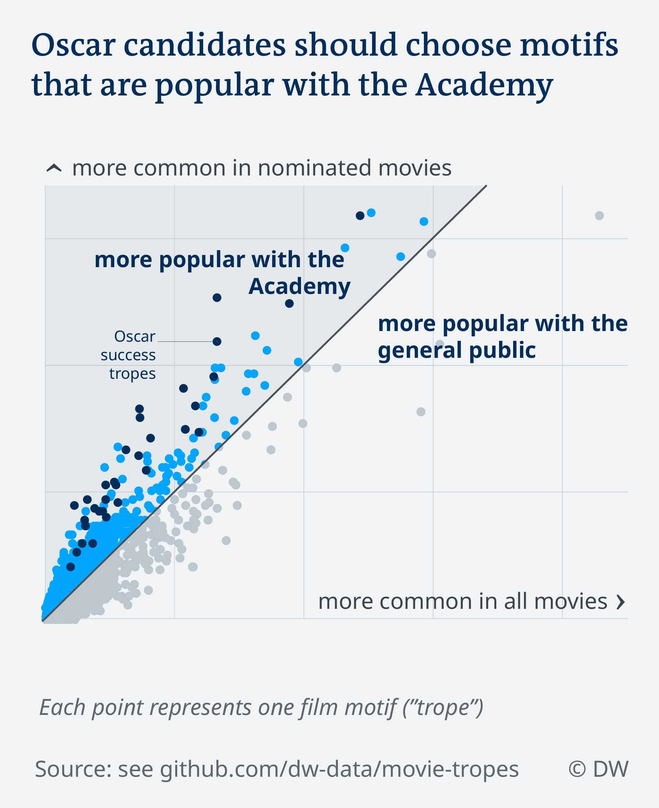

# Analyzing the tropes of 6637 Oscar-eligible movies

Ahead of the Oscars, DW wanted to look at what film chlichés say about Hollywood. So we analyzed the [TVTropes.org](https://tvtropes.org/) entries for 6637 Oscar-eligible movies from 1929 to 2019. In this repository, you will find the methodology, data and code behind the two stories that came out of this analysis.

## 1. The Oscar Academy's taste in movies
**Read the full article on DW.com:** [English](https://www.dw.com/xx) | [German](https://www.dw.com/a-47499539)

How does the Academy pick an Oscar nominee? Our data analysis shows which tropes help a movie get nominated as "Best Picture". Hint: Drama helps. So does alcohol.

*Idea, research, data analysis, visualization:* [Kira Schacht](https://twitter.com/daten_drang)

*Research and writing:* [Laura Döing](https://twitter.com/LauraDoeing)

\[[Jump to data analysis](#analysis_oscars)\]

## 2. What Hollywood movies do to perpetuate racial stereotypes
**Read the full article on DW.com:** [English](https://www.dw.com/a-47561660) | [German](https://www.dw.com/a-47561600)

Movies reflect stereotypes, but they also shape them. If Asians are portrayed as nerdy, black men as dangerous and Latinas as fiery, it influences perceptions. So what exactly does Hollywood have to say about various ethnic groups?

*Story:* [Kira Schacht](https://twitter.com/daten_drang)

\[[Jump to data analysis](#analysis_stereotypes)\]

# Interactive table of all tropes

On [this page](https://www.dw.com/a-47561660), you'll find an interactive table of all tropes we analyzed. Filter and search for your own stories!

# Data and code files

`tvtropes_analysis_oscars.R`				Script file for Oscars analysis

`tvtropes_analysis_stereotypes.R`			Script file for stereotypes analysis

# Methodology

The following text will explain the process behind this story: Which data sources were used, how the data was gathered and how the analyses were conducted.

## Background info

### The TVTropes wiki

The user-generated wiki [TVTropes](https://tvtropes.org/) documents the tropes that occur in any piece of media: Which TV shows [claim Elvis is still alive](https://tvtropes.org/pmwiki/pmwiki.php/Main/ElvisLives)? Which video games feature a [creepy child](https://tvtropes.org/pmwiki/pmwiki.php/Main/CreepyChild) character? Does a movie feature a white actor [dressed up to look Asian](https://tvtropes.org/pmwiki/pmwiki.php/Main/Yellowface)?

Users collect and maintain the data on the website, so there is bound to be some margin of error: Some tropes may be falsely interpreted to be in a movie, or, even more likely, some tropes might not be documented even though they are featured. Movies might also be missing entirely. Newer movies, for example, are always more likely to be featured than older ones, and newer movies tend to have more documented tropes per movie, since, on average, more users edit those entries.

The TVTropes wiki was still used for this analysis because it is still one of the best options for getting detailed and large-scale data on something as complex as reccurring cinematic motifs. As a precaution, entries that were only edited by one user were excluded. To counter the effect of having more data on more recent movies, the analysis uses the frequency of a trope compared to all tropes, instead of the share of movies that have a trope, when tracking prevalence over time.

### Oscars Eligibility guidelines

DW used the official Academy Awards eligibility rules to identify the movies to include in the sample. Oscar-eligible movies can be expected to be relatively successful in Hollywood, to they make for a good basis for analyzing the tastes of the Academy, as well as the stereotypes present in Hollywood movies.
The eligibility rules can be read in full [here](https://www.oscars.org/oscars/rules-eligibility), but this is the short version:
All eligible motion pictures must be:
- feature length (defined as over 40 minutes),
- played for paid admission in a commercial motion picture theater in Los Angeles County
- for a qualifying run of at least seven consecutive days
- between January 1 and midnight of December 31 of the year preceding the awards ceremony.

It would be next to impossible to identify all the movies that satisfied these criteria in the 91 years since the Oscars were first hosted. But thankfully, any movie that passes the application process gets recorded in a "Reminder List" that the Academy sends out for the jury's consideration prior to the announcement of the nominees.

## Data sources

### Reminder lists

Link: <https://www.atogt.com/askoscar/display-reminder-list-text.php>

Sources for Fact-checking: [official 91st reminder list](https://www.oscars.org/sites/oscars/files/91st_reminder_list.pdf) | [90th](https://www.oscars.org/sites/oscars/files/90th_reminder_list.pdf) | [89th](https://www.oscars.org/sites/oscars/files/89th_reminder_list.pdf) | [88th](https://www.oscars.org/sites/oscars/files/88th_reminder_list.pdf)

A list of all the movies eligible for an Oscar nomination, sent out yearly by the Academy. The reminder list has only been made publicly available online for the past four years, so the work of Richard "Flix" Brunner, who runs the website [atogt.com](https://www.atogt.com/), was used to provide a complete picture. Brunner has compiled the previous lists from online publications, historical archives and print copies he has collected over the past years. The publicly available reminder lists, as well as the database of nominees and winners, was used to check the data for accuracy.

### Nominees and Winners

Link: <http://awardsdatabase.oscars.org/>

The official Academy database provides an overview of all previous Oscar winners and nominees. It was used to check and complement the reminder list data and provide information on the movies' "Best Picture" winner/nominee status.

### IMDB dataset: Movie Metadata

Link: <https://www.imdb.com/interfaces/>

The IMDB dataset `title.basics.tsv.gz` contains metadata on all movies 

## Data gathering and cleaning

The script in `cleaning/tvtropes.R` contains the code used to scrape and combine the necessary data for this analysis. The steps are as follows. The R library `rvest` was used for scraping and the data cleaning software OpenRefine was used for pattern matching between metadata and TVTropes entries.

### 1. Build a sample from the pool of eligible Oscar movies

1. Scrape reminder lists from [atogt.com](https://www.atogt.com/askoscar/display-reminder-list-text.php) for all years.
1. Scrape nominees and winners from awards database
	* make sure all are included in eligibility lists and spellings match the awards database
1. Merge with IMDB data for further info where possible

**Result:** approx. 28200 eligible movies

### 2. Get TVTropes entries for the movies

1. Search for entries by scraping [Startpage](https://www.startpage.com/) results for: `"[movie title]" [movie year] host:tvtropes.org`
2. Filter out wrong links with pattern recognition / manual checks in OpenRefine
	* for more info on the link matching decisions, see `cleaning/tvtropes.R`, lines 192 to 229

**Result:** 6637 matched eligible movies

### 3. Get trope lists for matched movies from TVTropes entries

1. Scrape list of all trope links (contain `pmwiki.php/Main/`) from entry, scrape number of contributing users
2. Filter movies with less than 2 contributing users

**Result:** 21789 unique encountered tropes

## Data analysis

This is where the two stories differ. You'll find the analysis for the Oscars story in `tvtropes_analysis_oscars.R` and the one for the stereotypes story in `tvtropes_analysis_stereotypes.R`.

### Analysis: The Oscar Academy's taste in movies

Script file:  `tvtropes_analysis_oscars.R`

1. Descriptive analysis
	* Most common tropes in 2019 nominees
	* Check number of tropes and movies per year
	* Which genres appear most often?
		* By winner status: Share of genres in eligible vs. nominees vs. winners

2. Which film clichés will earn you an Oscars nomination?
	* Criteria: `oscarsYear >= 2000 & movies.withtrope > 50` (tropes occur at least 50 times in movies since the year 2000)
	* Question: Which tropes have a *statistically significant* impact on a movie’s chances of getting a nomination, be it positive or negative?
	* Test hypothesis: For each trope: Compare the likelihood of a nomination for movies with the trope to the likelihood of a nomination for movies without the trope
		* Conduct Fisher’s exact text for each trope with alpha = 0.05 (Bonferroni-adjusted)
	* Result:
		* 32 tropes have a statistically significant impact on the nomination chances of a movie
		* No tropes were found to have an impact on the chances of a nominee becoming a winner
		* 2 tropes were found to have a significant impact on getting from eligible to winner
		* For the article, we focused on the tropes that increase the chance of a nomination

3. Compare the frequency of tropes in all movies to the frequency in just the nominees
	* Show the difference in Academy taste vs. popular taste
	* Highlight the tropes found to have a significant impact

### Analysis: What Hollywood movies do to perpetuate racial stereotypes

Script file: `tvtropes_analysis_stereotypes.R`

1. Pick ethnic groups to focus on and compile a list of tropes about them via keyword search and background research
	* Main focus: Asians/Asian-Americans, black people
	* Additional analysis: Latin people, Germans, British people, Russians
2. Track tropes about Asians/Asian-Americans, black people over time
	* Count occurence of relevant tropes, as well as number of all tropes, by decade
	* Calculate frequency: `share of trope = number of occurrences / total number of tropes`
3. Get most common tropes about Latin people, Germans, British people, Russians
	* Use total number of occurences
	* Use only movies since 2000

